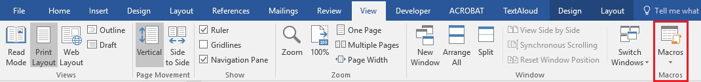
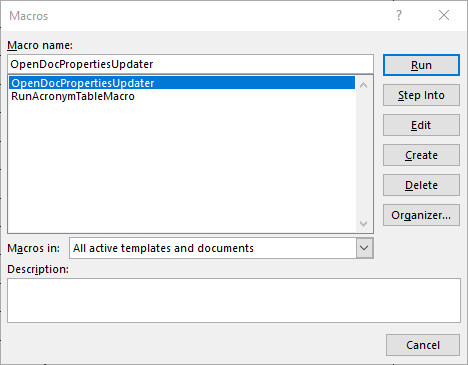
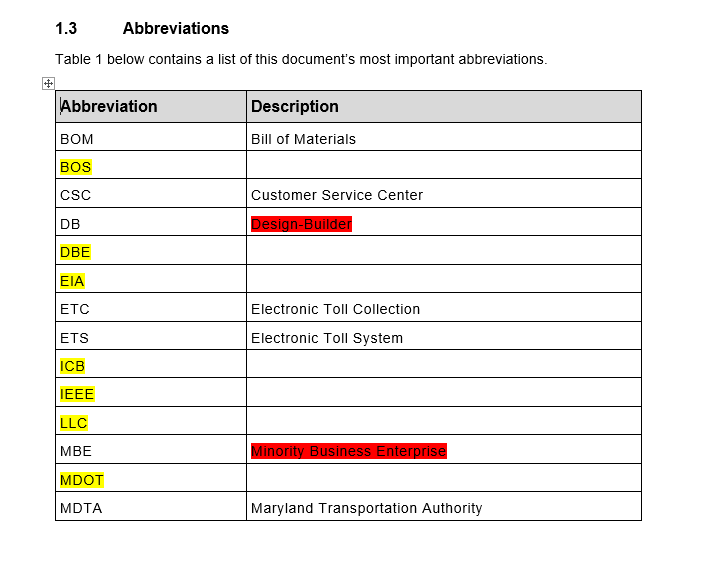

# Document Control Boilerplate Macros

_Please note_ that as of July 30th, 2018, the macros are no longer supported.

## Using the Macros

To view all of the macros that are currently on your system, navigate to the _View_ tab and click on the _Macros_ button to the far right of the ribbon.

### 1. Acronym Table Tool

1. Click anywhere inside of any document's _Acronym_ (or _Abbreviation_) table.
2. Click on the _Macros_ button in Word's _View_ tab to bring up the _Macros_ dialog.

3. Select _RunAcronymTableMacro_ from the list.
4. Run the Macro by clicking _Run_.

After you click _Run_, the macro will visit each cell in the acronym table. It will check if the acronym and its definition appear in the document. If an acronym or definition does not appear in the document, it is highlighted in red. After visiting each cell in the table, the macro will then search through the document. It locates words that it determines to be acronyms, inserts them in the table, and highlights them in yellow. When the macro has finished searching through the document, it sorts the Acronym table.

**Note:** This macro is not perfect. While it will likely discover all acronyms in the document, it may insert into the list some words that are not acronyms. If you find that the macro is regularly finding a word that is not an acronym, reach out to Alexander Porrello. He will add the words to the "duds" list.

### 2. Document Properties Updater

The document properties updater provides a painless way to update a document's metadata.

1. Click on the _Macros_ button in Word's _View_ tab to bring up the _Macros_ dialog.

2. Select _OpenDocPropertiesUpdater_ from the list.
4. Run the Macro by clicking _Run_. A window titled _Document Properties Updater_ will appear.

To update the document's properties, fill out the fields you wish to update and press the _Go_ button. The macro will update all of the properties and then refresh the document's fields. If a document property does not exist, the macro will create and populate it.

**Note:** When the updater runs, all blank fields will be ignored. (In other words, if you do not enter text into the _Document Title_ text field, the DocTitle property will not be updated.)