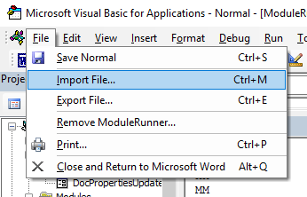

# Document Control Boilerplate Macros

## Installing the Macros

### 1. Enable the _Developer_ Tab

To use the macros in this repository, you must enable the _Developer_ tab in Microsoft Word:

1. Navigate to _File_ >> _Options_ to open the _Word Options_ screen.
2. Navigate to the _Customize Ribbon_ window.
3. In the _Main Tabs_ list on the right side, check the box next to _Developer_.
4. To save your changes and exit the window, click the _OK_ button.

Now, in the toolbar in Microsoft Word, you should see a _Developer_ tab:

### 2. Download the Macros

1. Visit the [Release page on GitHub](https://github.com/alexporrello/TWBoilerplateMacros/releases).
2. Underneath _Assets_, click the _Source code (zip)_ link to download the macros.
 
**Note:** You can confirm that you are downloading the latest version by locating the green box that says _Latest release_.
3. Navigate to your computer's default download location. The downloaded file should be called _TWBoilerplateMacros.zip_.
4. Extract the files from the downloaded _.zip_ folder.

### 3. Import the Files into Microsoft Word

1. Open Microsoft Word.
2. Navigate to the _Developer_ tab.
3. Click on _Visual Basic_ button to the far left of the ribbon.

This action opens Microsoft Visual Basic for Applications (VBA):

4. In VBA, navigate to _File_ >> _Import File..._

5. Browse to the directory where you unzipped the macros (most likely your _Downloads_ directory):

6. If you are running for the first time, import all of the visible files in the _forms_ folder and all of the visible items in the _modules_ folder. Since VBA does not support bulk importing, you will have to import them individually.

All of the macros should be available for use in all Word documents across your system.

## Using the Macros

To view all of the macros that are currently on your system, navigate to the _View_ tab and click on the _Macros_ button to the far right of the ribbon.

### 1. Acronym Table Tool

1. Click anywhere inside of any document's _Acronym_ (or _Abbreviation_) table.
2. Click on the _Macros_ button in Word's _View_ tab to bring up the _Macros_ dialog.

3. Select _RunAcronymTableMacro_ from the list.
4. Run the Macro by clicking _Run_.

After you click _Run_, the macro will visit each cell in the acronym table. It will check if the acronym and its definition appear in the document. If an acronym or definition does not appear in the document, it is highlighted in red. After visiting each cell in the table, the macro will then search through the document. It locates words that it determines to be acronyms, inserts them in the table, and highlights them in yellow. When the macro has finished searching through the document, it sorts the Acronym table.

**Note:** This macro is not perfect. While it will likely discover all acronyms in the document, it may insert into the list some words that are not acronyms. If you find that the macro is regularly finding a word that is not an acronym, reach out to Alexander Porrello. He will add the words to the "duds" list.

### 2. Document Properties Updater

The document properties updater provides a painless way to update a document's metadata.

1. Click on the _Macros_ button in Word's _View_ tab to bring up the _Macros_ dialog.

2. Select _OpenDocPropertiesUpdater_ from the list.
4. Run the Macro by clicking _Run_. A window titled _Document Properties Updater_ will appear.

To update the document's properties, fill out the fields you wish to update and press the _Go_ button. The macro will update all of the properties and then refresh the document's fields. If a document property does not exist, the macro will create and populate it.

**Note:** When the updater runs, all blank fields will be ignored. (In other words, if you do not enter text into the _Document Title_ text field, the DocTitle property will not be updated.)