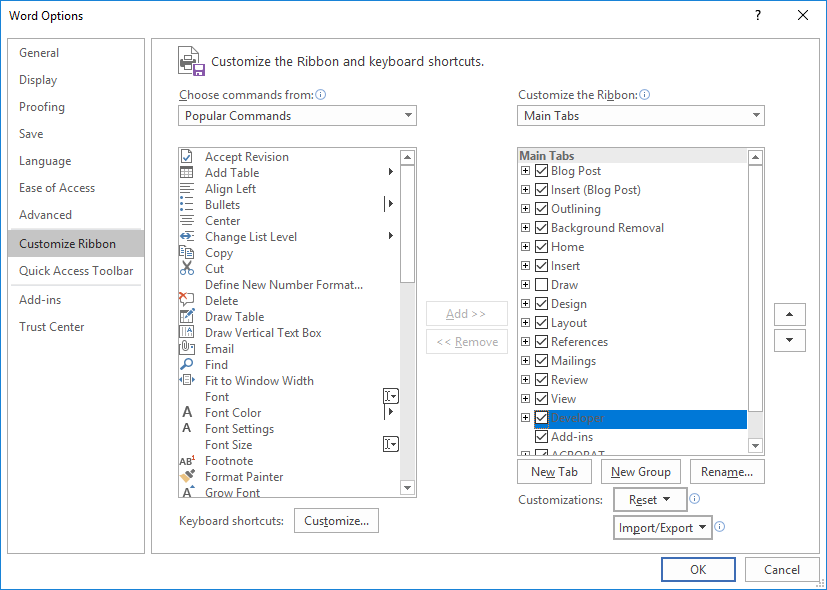
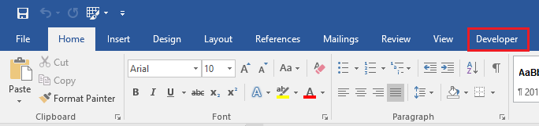
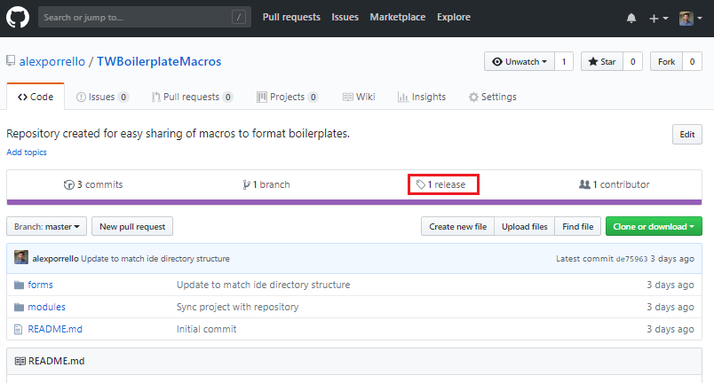
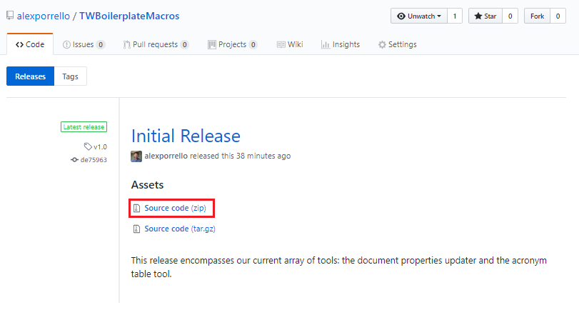
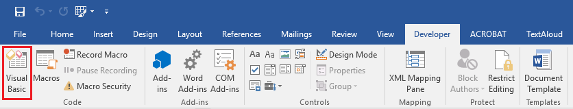
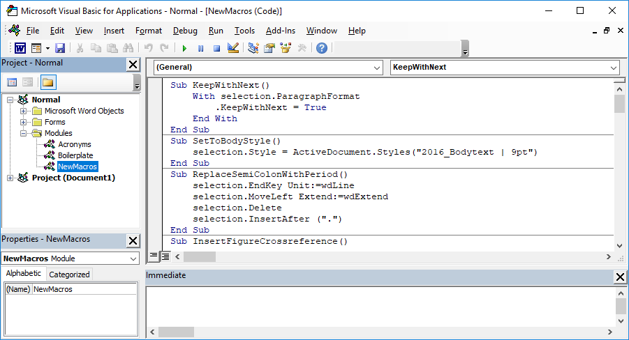
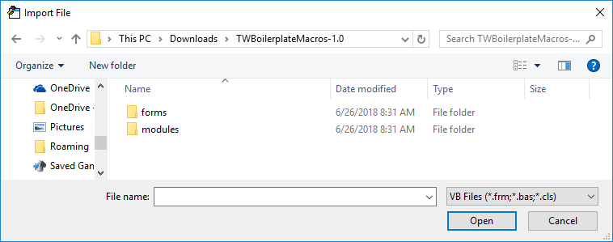

# TWBoilerplateMacros

## Enabling the _Developer_ Tab

To use the macros in this repository, you must enable the _Developer_ tab in Microsoft Word:

1. Naviage to _File_ >> _Options_ to open the _Word Options_ screen.
2. Navigate to the _Customize Ribbon_ window.
3. In the _Main Tabs_ list on the right side, check the box next to _Developer_.
4. To exit the window, click the _OK_ button.

Now, in the toolbar in Microsoft Word, you should see a _Developer_ tab:

## Installing the Macros

### Download the Files

1. Visit the _release_ tab on the GitHub repository page.

2. Underneath _Assets_, click the _Source code (zip)_ link to download the macros.

**Note:** You can confirm that you are downloading the latest version by checking for the green box that says _Latest release_.
3. Navigate to your default download location on your computer. The downloaded file should be called _TWBoilerplateMacros.zip_.
4. Extract the files from the downloaded _.zip_ folder.

### Import Files Into Microsoft Word

1. Open Microsoft Word.
2. Navigate to the _Developer_ tab.
3. Click on _Visual Basic_ button to the far left of the ribbon.
 
This action opens Visual Basic for Applications (VBA):

 
4. In VBA, navigate to _File_ >> _Import File..._
5. Browse to the directory where you unzipped the macros ( most likely your _Downloads_ directory):

6. If you are running for the first time, import all of the items in _forms_ and all of the items in _modules_. Double click on any visible file to import it into VBA.
**Note:** Unfortunatley, VBA only supports importing one file at a time. You will only have to import the files one at a time.

Assuming you followed the above steps correctly, all of the macros should have been imported into your normal template.

## Using the Macros