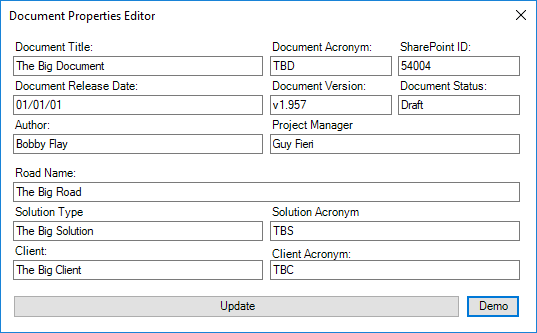

# Document Control Ribbon

## Overview

The Document Control Ribbon is a VSTO Word Add-in, written in C# and created by Alexander Porrello to streamline technical writing and document control tasks. This add-in is compatible with Word 2013, 2016, and Office 365.

## 1. _Document_ Group

Contained within the _Document_ Group are five buttons:

1. _Document Properties Editor_
2. _Import Styles_
3. _Accept All Changes_
4. _Show/Hide Formatting Marks_
5. _Show/Hide Spelling Errors_

### 1.1. _Document Properties Editor_ Button

The _Document Properties Editor_ Button opens the _Document Properties Editor_ Window:

The _Document Properties Editor_ Window provides technical writers and the document control team with a convenient way to update standard metadata. To use the _Document Properties Editor_ Window...

1. Fill in the fields that need to be updated.
2. Click _Update_ to update the active document's properties.

**Note:** The _Document Properties Editor_ will ignore all blank text fields. For example, if you do not enter text into the _Document Title_ text field, the _DocTitle_ property will not be updated.

### 1.2. _Import Styles_ Button

The _Import Styles_ button downloads the latest company template from this GitHub repository and imports its styles into the active document.

### 1.3. _Accept All Changes_ Button

Clicking this button accepts all changes in the active document.

**Note:** This tool is still under development. Clicking this button only accepts changes in the active document's body.

### 1.4. _Show/Hide Formatting Marks_ Button

Clicking the _Show/Hide Formatting Marks_ button will toggle the visibility of formatting marks in the active document:

**Toggled:**

**Untoggled:**

### 1.5. _Show/Hide Spelling Errors_ Button

Clicking the _Show/Hide Spelling Errors_ Button will toggle the visibility of spelling errors in the active document.

**Toggled:**

**Untoggled:**

## 2. _Style_ Group

Contained within the _Style_ Group are eight buttons. These buttons and their functions are defined below:

1. **_Insert Section Break:_** Inserts a section break at the cursor position in the active document.
1. **_Headings_ Dropdown:** A dropdown by which heading styles can be easily applied.
1. **_Body_:** Applies the company's default _Body_ style to all selected paragraphs.
1. **_Figure_:** Applies the company's default _Figure_ style to all selected paragraphs or figures.
1. **_Marking_:** Applies the company's default _Marking_ style to all selected paragraphs.
1. **_Keep With Next_:** Sets the _Keep With Next_ paragraph property to _true_ for the selected paragraph or paragraphs.
1. **_Format All Figures_:** Applies the company's default _Figure_ style to all figures in the document.
1. **_Page Break Before_:** Sets the _Page Break Before_ paragraph property to _true_ for the selected paragraph or paragraphs.

## 3. _List_ Group

Contained within the _Style_ Group are two buttons and two dropdowns:

1. _Apply Default Unordered List_ Button
1. _Apply UL_ Dropdown
1. _Apply Default Ordered List_ Button
1. _Apply OL_ Dropdown

### 3.1. _Apply Default Unordered List_ Button

This button applies the default level one unordered list style to a selected paragraph or paragraphs.

### 3.2. _Apply UL_ Dropdown

By using this dropdown, users can easily and uniformally apply unordered list levels one through five to a selected paragraph or selected paragraphs.

### 3.3. _Apply Default Ordered List_ Button

This button applies the default level one ordered list style to a selected paragraph or paragraphs.

### 3.4. _Apply OL_ Dropdown

By using this dropdown, users can easily and uniformally apply ordered list levels one and two to a selected paragraph or selected paragraphs.

## 4. _Table_ Group

Contained within the _Table_ Group are four buttons:

1. _Format Table_
2. _Acronym Table Updater_
3. _Update Wordlist_
4. _Update Duds List_

### 4.1. _Format Table_ Button

Clicking on the _Format Table_ Button after clicking into a table will format the table in the company's official style.

### 4.2. _Acronym Table Updater_ Button

Clicking on the _Acronym table Updater_ Button kicks off the following events:

1. The app locates the _Acronym_ or _Abbreviation_ Table.
2. The app checks that all acronyms and definitions exist in the document body. Any that it cannot find in the document's body are highlighted in red.
3. The app then looks at each word in the document and, using the following criteria, determines if it is an acronym:
    * Is the word a known acronym? (If it is, insert it and its definition into the table and highlight the cells in yellow.)
    * Are all of the letters in the word capitalized?
    * Is the character length of the word greater than one and less than eight?
    * Is the word composed entirely of alphabetical characters?
    * Is the word not in the system dictionary?
    * Is this word not a known false-positive?
4. If the word satisfies all of the requirements, it is inserted into the table and highlighted in yellow.
5. After all of the found acronyms are added to the table, the app sorts the table alphabetically.

**Note:** The top left cell of the acronym table must read _Acronym_, _Acronyms_, _Abbreviation_, or _Abbreviations_. If the top left of the table is not one of these four options, the tool will be unable to locate the table and will throw an error.

### 4.3. _Update Wordlist_ and _Update Duds List_ Buttons

These buttons update a set of files stored on the user's machine. These files contain all known acronyms and their definitions. It is only necessary to press these buttons when instructed by the system administrator.

**Note:** In order for these buttons to work, the user has to be disconnected from the company's VPN. 

## 5. _Cross-references_ Group

Contained within the _Cross-references_ Group are three buttons. These buttons and their functions are defined below:

1. **_Insert Figure Caption:_** Inserts a properly formatted figure caption at the cursor's location. 
1. **_Insert Table Caption:_** Inserts a properly formatted table caption at the cursor's location.
1. **_Update All Fields:_** Updates all of the field codes in the document and refreshes the user's view.